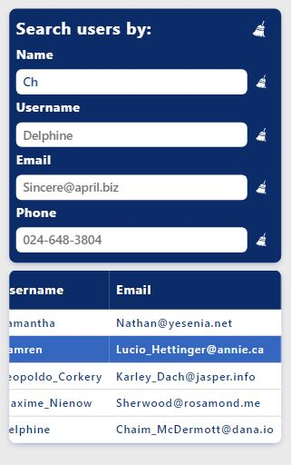
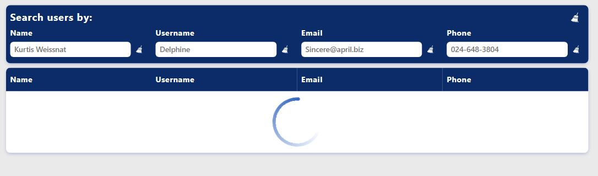
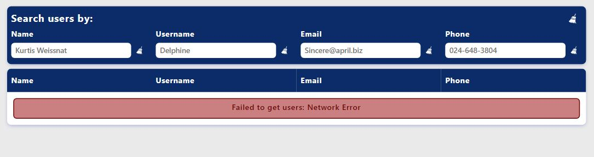

# User Management Table

## About project

This web application is designed to display user data received from the JSONPlaceholder API as a table, and also allows
you to filter their display in real time by name, username, email and phone fields.

## Features

- ### Display users in a table


- ### Filter users data in real time


- ### Responsive layout



- ### Loader and notifications when working with data

#### Loader



#### Notifications




## Technology stack

- TypeScript
- React
- Redux Toolkit
- CSS

## Installation

1. **Clone the repository to your local machine:**

   ```bash
   git clone https://github.com/your-username/project-name.git
   cd project-name
   ```

2. **Install the dependencies:**

   npm:

   ```bash
   npm install
   ```

   yarn:

   ```bash
   yarn install
   ```

3. **Running the project:**

   ```bash
   npm start
   ```

Next, you can view the work of the project at http://localhost:3000
